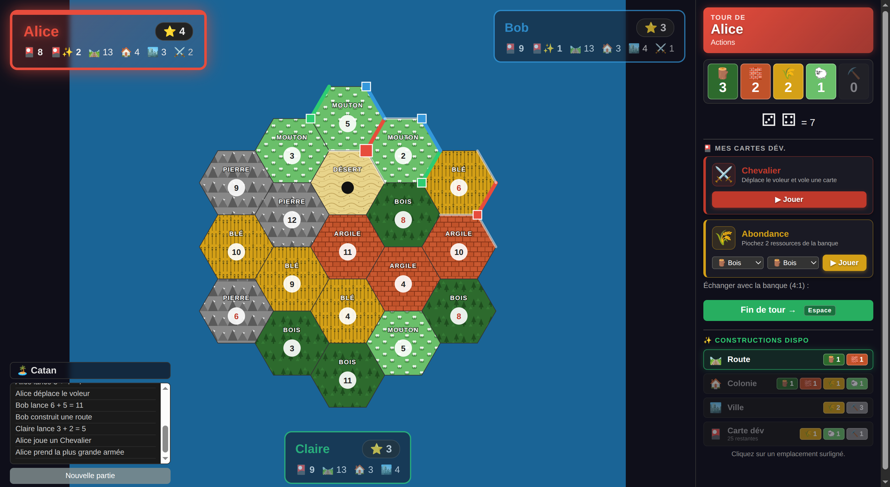

# 🏝️ Catan

Adaptation **hotseat** des Colons de Catan pour 2-4 joueurs sur le même écran, en React + TypeScript + Vite. Jouable en ligne sur **[catan.once.florent.cc](https://catan.once.florent.cc)**.



## Fonctionnalités

- 2 à 4 joueurs sur le même écran, pseudo hotseat
- Placement initial en serpent (2 colonies + 2 routes)
- Production sur jet de dés, voleur sur un 7, défausse >7 cartes, vol
- Construction : route, colonie, ville, carte dév
- Cartes dév : chevalier, abondance (année de plenty), monopole, construction de routes, point de victoire
- Plus grande armée (+2 PV dès 3 chevaliers joués)
- Échange 4:1 avec la banque
- Victoire à 10 PV
- Sauvegarde locale automatique (`localStorage`)
- **Responsive** : layout desktop (sidebar) + layout mobile (modale ressources, plateau fluide)

Non inclus : ports, commerce entre joueurs, plus longue route.

## Stack

- React 19 + TypeScript
- Vite 8
- Vitest (tests du reducer + des règles)
- ESLint
- Zéro dépendance applicative (pas de lib de jeu, le moteur est fait main)

## Dev

```bash
npm install
npm run dev        # http://localhost:5173
npm run test       # tests vitest
npm run lint
npm run build
```

### Fixture de démo

URL avec `?fixture=mid` pour charger un état "milieu de partie" (utile pour screenshots / démo sans passer par le setup) :

```
http://localhost:5173/?fixture=mid
```

## Déploiement

Image Docker publiée en CI sur `ghcr.io/florentdestremau/catan:master`, déployée via [once](https://once.florent.cc) :

```bash
once update catan.once.florent.cc --image ghcr.io/florentdestremau/catan:master
```

## Structure

- `src/game/` — moteur pur (types, règles, reducer, setup, fixtures)
- `src/components/` — UI React (Board SVG, PlayerPanel, Controls, ResourcesModal, Setup, Log, GainOverlay)
- `src/App.tsx` — assemblage + hook `useIsMobile` pour la branche mobile
